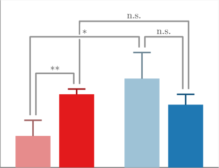

[][fex]

superbar
========

Make bar charts rammed full of extra features: 
- in full technicolor, with a unique colour for every bar
- showing errors on the values using errorbars, with many styles available 
- with statistical significance of each bar indicated with stars above them
- with statistical significance of comparisons between pairs of bars shown with
  lines between the pairs and stars above them 
- and all this in either horizontal or vertical orientations

Documentation for `superbar` is available through the MATLAB help interface,
accessible with `help superbar`.

An interactive tutorial is also included, available at
[demos/demo_superbar.m](demos/demo_superbar.m).
This showcases the features of `superbar` and compares the API with that of
the built-in `bar` function.

supererr
--------

The function `supererr`, which is used to add the errorbars to the bar chart,
can also be used as a stand-alone function, and has extra features compared
with MATLAB's `errorbar`:
- plot in x and/or y directions
- manipulate width of errorbar caps
- symmetric or asymmetric errorbars
- many different errorbar styles 
    - with or without caps
    - caps alone without a stave
    - single or dual directional bars

License
-------

See the [LICENSE](LICENSE) file for license rights and limitations (MIT).

  [fex]:            http://mathworks.com/matlabcentral/fileexchange/57499-superbar
